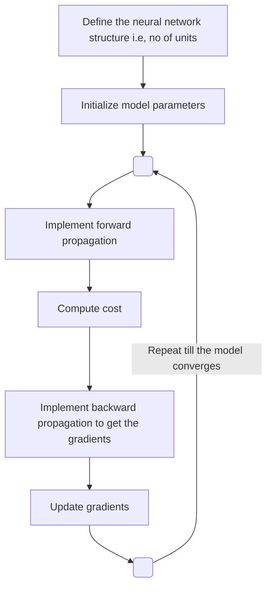

*This blog is a part of [deeplearning.ai series](/deeplearning-ai-andrew-ng-coursera)  
Github Code: [Neural Network with single hidden layer](https://github.com/sabbiu/deeplearning.ai-coursera/blob/master/p1.coursera_server/Week%203/Planar%20data%20classification%20with%20one%20hidden%20layer/Planar%20data%20classification%20with%20one%20hidden%20layer%20v4.ipynb), 
[Neural Network with multiple hidden layer](https://github.com/sabbiu/deeplearning.ai-coursera/blob/master/p1.coursera_server/Week%204/Building%20your%20Deep%20Neural%20Network%20-%20Step%20by%20Step/Building%20your%20Deep%20Neural%20Network%20-%20Step%20by%20Step%20v5.ipynb),
[Implementation to identify cat](https://github.com/sabbiu/deeplearning.ai-coursera/blob/master/p1.coursera_server/Week%204/Deep%20Neural%20Network%20Application_%20Image%20Classification/Deep%20Neural%20Network%20-%20Application%20v3.ipynb)*

## Neural Network with Single Hidden Layer

Steps for implementing neural network can be given as follows:

**Define the neural network structure**

At first we determine the neural network architecture by fixing the number of nodes to use in a hidden layer. In this case,  
$m$ is # of training examples  
L (# of layers) = 2  
$W^{[1]} \text{ is } (4 \times 2)$  
$b^{[1]} \text{ is } (4 \times 1)$  
$W^{[2]} \text{ is } (1 \times 4)$  
$b^{[2]} \text{ is } (1 \times 1)$  

The following equations are the vectorized implementation across all examples.

**Initialize model parameters**

We initialize all the above parameters ($W^{[1]}$, $b^{[1]}$, $W^{[2]}$, $b^{[2]}$ ) to some random numbers.

**Forward Propagation**

Using those randomly initialized value, we calculate the followings:

$$
\begin{aligned}
Z^{[1]} & = W^{[1]}X + b^{[1]}\\
A^{[1]} & = g(Z^{[1]})\\
Z^{[2]} & = W^{[2]}A^{[1]} + b^{[2]}\\
A^{[2]} & = g(Z^{[2]})\\
\end{aligned}
$$

We can substitute $X$ to be $A^{[0]}$ and have a general equation as,

$$
\begin{aligned}
Z^{[l]} & = W^{[l]}A^{[l-1]} + b^{[l]}\\
A^{[l]} & = g(Z^{[l]})\\
\end{aligned}
$$

**Compute Cost**

$$
J=-\frac{1}{m}\sum_{i=0}^m (y^{(i)} \log (a^{[2](i)})+(1-y^{(i)})log(1-a^{[2](i)}))
$$

**Implement backward propagation to get the gradient**

$$
\begin{aligned}
\mathcal{d}Z^{[2]} & = A^{[2]}-Y\\
\text{where,}& \\
& \mathcal{d}Z^{[2]} \text{ is } (1 \times m)\\
& A^{[2]} \text{ is } (1 \times m)\\
& Y \text{ is } (1 \times m)\\
\\
\mathcal{d}W^{[2]} & = \frac{1}{m}\mathcal{d}Z^{[2]}A^{[1]T}\\
\text{where,}& \\
& \mathcal{d}W^{[2]} \text{ is } (1 \times 4)\\
& A^{[1]} \text{ is } (4 \times m)\\
\\
\mathcal{d}b^{[2]} & = \frac{1}{m}\text{np.sum}(\mathcal{d}Z^{[2]},\text{ axis=}1)\\
\text{where,}& \\
& \mathcal{d}b^{[2]} \text{ is } (1 \times 1)\\
\\
\mathcal{d}Z^{[1]} & =
\frac{\mathcal{dL}}{\mathcal{d}Z^{[2]}}
\frac{\mathcal{d}Z^{[2]}}{\mathcal{d}a^{[1]}}
\frac{\mathcal{d}a^{[2]}}{\mathcal{d}Z^{[1]}}\\
 & = \mathcal{d}Z^{[2]} \frac{\mathcal{d}Z^{[2]}}{\mathcal{d}a^{[1]}} * g^{[1]'}(Z^{[1]})\\
 & = \mathcal{d}W^{[2]T} \mathcal{d}Z^{[2]} * g^{[1]'}(Z^{[1]})\\
\text{where,}& \\
& \mathcal{d}Z^{[1]} \text{ is } (4 \times m)\\
\\
\mathcal{d}W^{[1]} & = \frac{1}{m}\mathcal{d}Z^{[1]}X^T\\
\text{where,}& \\
& \mathcal{d}W^{[1]} \text{ is } (4 \times 2)\\
& X \text{ is } (2 \times m)\\
\\
\mathcal{d}b^{[1]} & = \frac{1}{m}\text{np.sum}(\mathcal{d}Z^{[1]},\text{ axis=}1)\\
\text{where,}& \\
& \mathcal{d}b^{[1]} \text{ is } (4 \times 1)\\
\end{aligned}
$$

**Update Gradients**

Now, we update the gradients to the specific parameters.

**Prediction**

After repeating the updation process, the model converges, then we use the obtained parameters to predict the label of data using forward propagation. The obtained output from forward propagation is $A^{[2]}$. If $A^{[2]} > 0.5$, then we label this data as positive.

## Neural Network with L hidden layer

