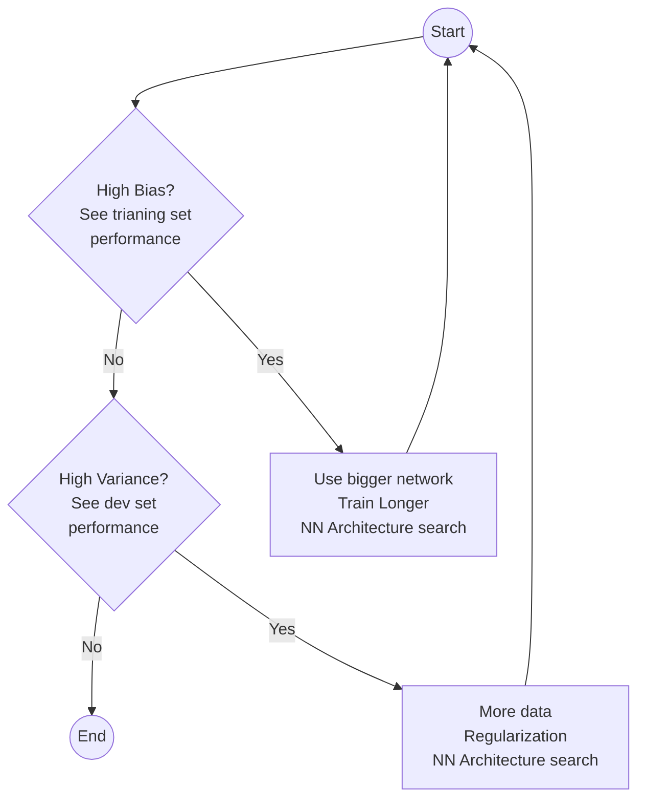

*This blog is a part of [deeplearning.ai series](/deeplearning-ai-andrew-ng-coursera)*

Applied Machine Learning is a highly iterative process. We need to tune various hyperparameters such as:  
  - \# of layers
  - \# of hidden units
  - learning rates
  - activation functions
  - and so on...

We first divide our datasets in three set, namely, Train, Dev and Test sets. The distribution of data must be similar accross all these sets.
Training datasets are used for training the model. We fix the parameters and train our model with these data. Then, once our training model gives better accuracy, we cross validate using dev datasets. We then, tune the parameters of our model accordingly. Once we are satisfied with the accuracy on train and dev sets, we finnaly test the working of model with our test datasets. Not having a test set is also okay.

Previously, it was common practice to use 70% of data as training and remaining 30% as test or (60% train, 20% dev, 20% test). Now, due to a large number of examples available (~1Million), we divide them to (98% train, 1% dev, 1% test) or (99.5%, 0.4%, 0.1%).

## Bias/Variance

Figure below represents underfitting, just right and overfitting a model.

Before training any model, we first estimate human accuracy for the model, also know as Optimal (Bayes) error. Let us take an example of cat classification. Here, Optimal (Bayes) error is ~0%.
The following table gives various scenario to determine whether the model has higher/lower bias/variance or is it just right.

|Train Set Error|Dev Set Error|Remarks|
|:--:|:--:|--|
|1 %|11 %|High Variance (Overfitting)|
|15 %|16 %|High Bias (Underfitting)|
|15 %|30 %|High Bias and High Variance|
|0.5 %|1 %|Low Bias and Low Variance|

High Bias and High Variance model looks like this:  

We follow the following recipe for training a ML model:

