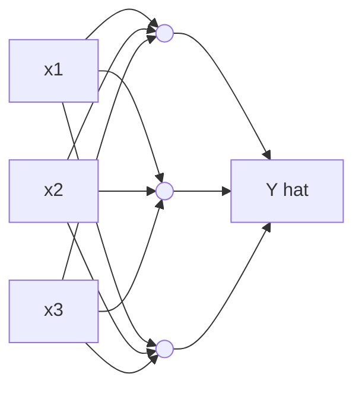
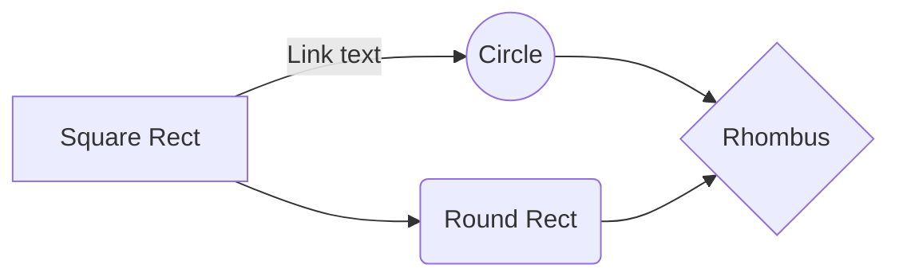
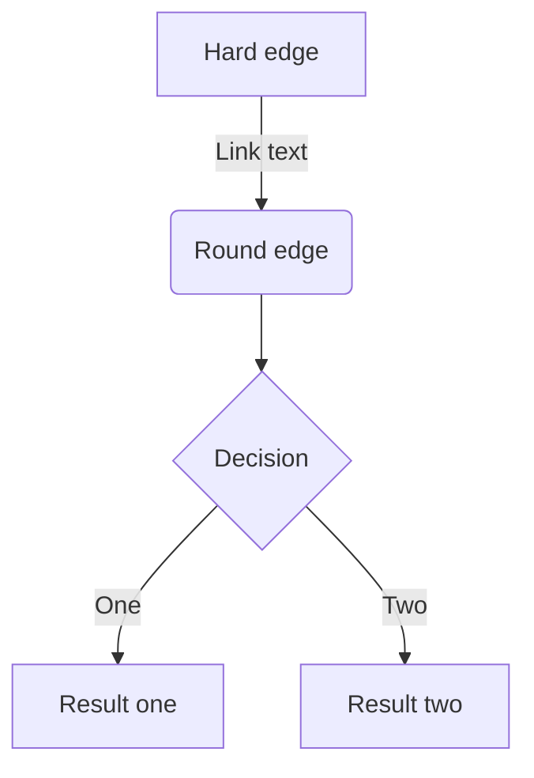

Testing flowchart implementation

## Example 1: Flowchart

```mermaid
graph LR
  X[x1] --> A(( ))
  Y[x2] --> A(( ))
  Z[x3] --> A(( ))
  X[x1] --> B(( ))
  Y[x2] --> B(( ))
  Z[x3] --> B(( ))
  X[x1] --> C(( ))
  Y[x2] --> C(( ))
  Z[x3] --> C(( ))
  A --> y[Y hat]
  B --> y[Y hat]
  C --> y[Y hat]
```

```mermaid
graph LR
    A[Square Rect] -- Link text --> B((Circle))
    A --> C(Round Rect)
    B --> D{Rhombus}
    C --> D
```

```mermaid
graph TD
    A[Hard edge] -->|Link text| B(Round edge)
    B --> C{Decision}
    C -->|One| D[Result one]
    C -->|Two| E[Result two]
```

### other

