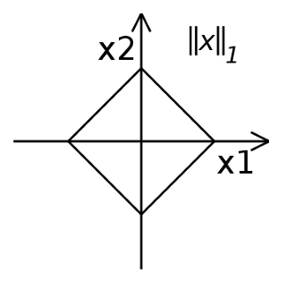
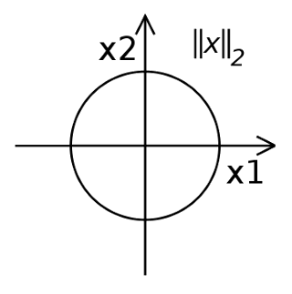
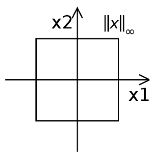

Norms are a measure of distance. Norm is defined as follows:
For $p\geq1$,

$$
||x||_p \equiv \sqrt[p]{|x_1|^p + |x_2|^p + ... + |x_n|^p}
$$

### Taxicab Norm (1-Norm)

When $p=1$, then the norm is said to be taxicab norm. The distance derived from
this norm is called Manhattan distance.

$$
||x||_1 \equiv |x_1| + |x_2| + ... + |x_n|
$$

### Euclidean Norm (2-Norm)

It is the most common notion of distance. When $p=2$, then the norm is said to
be euclidean norm.

$$
||x||_2 \equiv \sqrt{|x_1|^2 + |x_2|^2 + ... + |x_n|^2}
$$

### ∞-norm

Infinity norm is defined as,

$$
||x||_\infty \equiv max(|x_1|, |x_2|, ..., |x_n|)
$$

**Proof**

$$
\begin{aligned}
||x||_p & \equiv \sum_{i=1}^n |x_i|^p\ \ \ \ \ \ \ \ \ \ \text{Equation of p-norm}\\
||x||_p & \equiv m \sum_{i=1}^n \frac{|x_i|^p}{m}\ \ \ \ \ \ \ \ \ \ m=max(|x_i|)\\
\end{aligned}
$$

As, $p$ approaches $\infty$, only the term $\frac{max|x_i|}{m}$ equals to $1$,
while other terms approaches to $0$. Thus, $\sum_{i=1}^n \frac{|x_i|^p}{m} = 1$

$$
\begin{aligned}
\therefore\ ||x||_\infty & \equiv max(|x_i|)
\end{aligned}
$$

### Visualising norms as a unit circle

This section will show visualization when, $||x||_p \equiv 1$. Let us consider for 2 Dimensional case.

#### 1-Norm

The equation is given as,

$$
\begin{aligned}
& ||x||_1 = |x_1| + |x_2|\\
\implies & 1= |x_1| + |x_2|\\
\end{aligned}
$$

Thus we get the following equations,  
When $x_1\geq0$ and $x_2\geq0$, $x_2=1-x_1$ [First quadrant]  
When $x_1\leq0$ and $x_2\geq0$, $x_2=1+x_1$ [Second quadrant]  
When $x_1\leq0$ and $x_2\leq0$, $x_2=x_1-1$ [Third quadrant]  
When $x_1\geq0$ and $x_2\leq0$, $x_2=-x_1-1$ [Fourth quadrant]

Plotting these equations, we get,

#### 2-Norm

The equation is given as,

$$
\begin{aligned}
& ||x||_2 = \sqrt{|x_1|^2 + |x_2|^2}\\
\implies & 1= x_1^2 + x_2^2\\
\end{aligned}
$$

As this equation represents a unit circle, we get the following graph,

#### ∞-norm

The equation is given as,

$$
\begin{aligned}
& ||x||_\infty = max(|x_1|, |x_2|)\\
\implies & 1 = max(|x_1|, |x_2|)\\
\end{aligned}
$$

This gives the following graph,

Substituting different values of p, these equations can be further visualised in
[Wolfram Mathematica Demonstaration](http://demonstrations.wolfram.com/UnitNormVectorsUnderDifferentPNorms/)

<iframe
  src="//demonstrations.wolfram.com/UnitNormVectorsUnderDifferentPNorms/"
  width="780"
  height="600"
></iframe>

#### _References_

1. [excerpt justin solomon, mathematical methods for robotics, vision, and graphics](https://www.youtube.com/watch?v=wjbrY6zHmMA&t=1101)
2. [wolfram mathematica norms demonstration](http://demonstrations.wolfram.com/UnitNormVectorsUnderDifferentPNorms/)
3. [wikipedia article on lp space](https://en.wikipedia.org/wiki/Lp_space)
